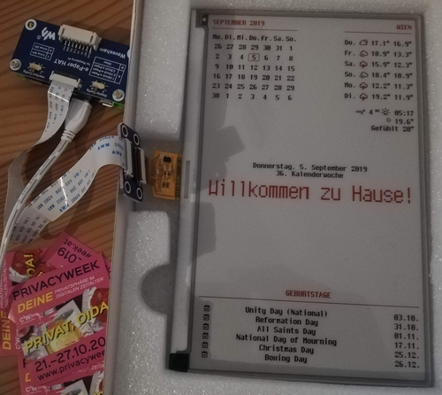

## How it works
This script is started by [alexrashed's rpi-magic-mirror-eink](https://github.com/alexrashed/rpi-magicmirror-eink), but has been updated to use with modern waveshare libraries and cron.

The python script uses [pyppeteer (Python implementation of Chromium's instrumentation API)](https://github.com/miyakogi/pyppeteer) to take a screenshot of a website (usually a locally running instance of [MagicMirror²](https://magicmirror.builders)) and then renders the screenshot on Waveshare's 7.5" 3-color display.   

I'm hosting magic mirror on my server, so I don't actually run it locally on the zero. If you have a zero w v2, you'll have no trouble hosting and running this script. If you have a zero 2 v1, you might struggle a bit. 

## Requirements
- Raspbian Buster (Python 3.6+)
- Waveshare 7.5 3-color epaper display
- Ikea RIBBA frame (13x18cm)

## Installation
- Enable the SPI is enabled by uncommenting the following line in `/boot/config.txt`:
  ```
  dtparam=spi=on
  ```
- Install some packages:
  ```bash
  sudo apt update && sudo apt install git libatlas-base-dev -y
  # Make sure to check the script before executing the next part! You are about to pipe a script from the world wide web to bash! At least it's not root...
  # only install this if you are going to run magic mirror locally
  curl -o- https://raw.githubusercontent.com/nvm-sh/nvm/v0.34.0/install.sh | bash
  nvm install --lts
  ```
- We need an older version of chrome (as there are problems with the current puppeteer version and Chromium 74):
  - Create a sources list for stretch:
    ```bash
    sudo nano /etc/apt/sources.list.d/stretch.list
    ```
  - Add the following two lines:
    ```
    deb http://archive.raspberrypi.org/debian/ stretch main ui 
    deb-src http://archive.raspberrypi.org/debian/ stretch main ui
    ```
  - Add a default apt settings file:
    ```bash
    sudo nano /etc/apt/apt.conf.d/default
    ```
  - Set the default apt release to buster by adding the following line:
    ```
    APT::Default-Release "buster";
    ```
  - Install the chromium version from the stretch repo:
    ```bash
    sudo apt update && sudo apt-get install -t stretch chromium-browser -y
    ```
- Install MagicMirror² if you're going to run magic mirror locally:
  ```bash
  mkdir repos
  cd repos
  git clone https://github.com/MichMich/MagicMirror
  cd MagicMirror
  npm install
  # Ignore the electron install error (if it occurs) and install the vendor and font packages manually:
  npm run install
  npm run install-fonts
  ```
- Clone this repository:
  ```bash
  cd ~/repos
  git clone https://github.com/lhoggatt17/rpi-magicmirror-eink.git
  ```
- Setup the Python environment, use the default python3 installation. If you plan on using the pi for anything else, consider trying the latest version of some of these packages:
  ```bash
  cd rpi-magicmirror-eink
  pip3 install -r requirements.txt
  ```
- If running magic mirror locally, Copy the MagicMirror² config, CSS and fonts into the MagicMirror directory:
  ```bash
  cp -r ./magicmirror-files/. ~/repos/MagicMirror
  ```
- If running magic mirror locally, Install the MagicMirror modules:
  ```bash
  cd ~/repos/MagicMirror/modules
  git clone https://github.com/alexrashed/calendar_monthly.git
  ```
- If running magic mirror locally, Adjust the config to your needs (set calendars, weather info,...):
  ```bash
  nano ~/repos/MagicMirror/config/config.js
  ```
- If running magic mirror locally, Intall PM2:
  - Install the package globally:
    ```bash
    npm install -g pm2
    pm2 startup
    ```
  - If running magic mirror locally, Make sure to execute the command which is printed (DO NOT JUST COPY THIS, IT WILL BE DIFFERENT):
    ```bash
     sudo env PATH=$PATH:/home/pi/.nvm/versions/node/v10.16.3/bin /home/pi/.nvm/versions/node/v10.16.3/lib/node_modules/pm2/bin/pm2 startup systemd -u pi --hp /home/pi
    ```
- If running magic mirror locally, Setup the automatic startup on boot for MagicMirror:
  ```bash
  # Make sure to execute the command which is printed
  # Adjust the path (if MagicMirror is not directly in your home)
  nano ~/repos/MagicMirror/installers/pm2_MagicMirror.json
  # Adjust the path (if MagicMirror is not directly in your home) and replace the command with `node serveronly`
  nano ~/repos/MagicMirror/installers/mm.sh
  # If your user is not 'pi' checkout these lines before:
  # https://github.com/MichMich/MagicMirror/blob/master/installers/raspberry.sh#L223
  pm2 start ~/repos/MagicMirror/installers/pm2_MagicMirror.json
  pm2 save
  ```
- Setup the automatic startup on boot for the python script:
  ```bash
  Run:
  crontab -e
  
  Add this line at the bottom of your cron file to refresh your screen every 10 minutes:
  */10 * * * * bash /home/pi/Documents/rpi-magicmirror-eink/run.sh
  ```

## Configuration
Currently the script is configured by modifying the global variables at the top of [main.py](main.py).
The cron schedule can be adjusted in the [run.sh](run.sh) script.

## Resources
- Reused the [Cherry bitmap font files](https://github.com/turquoise-hexagon/cherry) by [marin](https://github.com/turquoise-hexagon) converted to ttf with [Bits'N'Picas](https://github.com/kreativekorp/bitsnpicas) by [BenRoe](https://github.com/BenRoe/)
- The waveshare epaper library
- The project uses the Original Library written by Waveshare. It can be downloaded [here](https://www.waveshare.com/wiki/Main_Page#OLEDs_.2F_LCDs).

